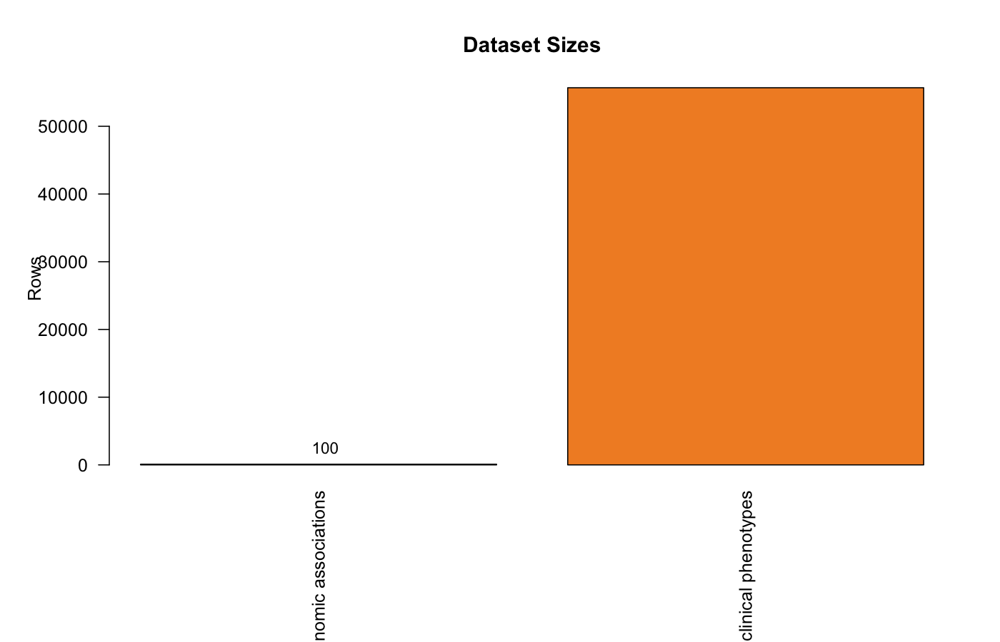
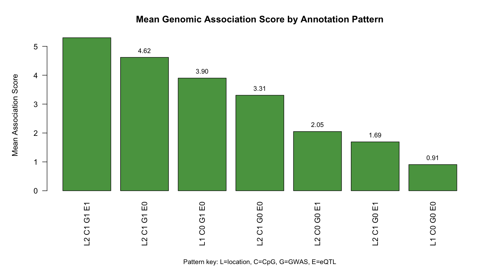
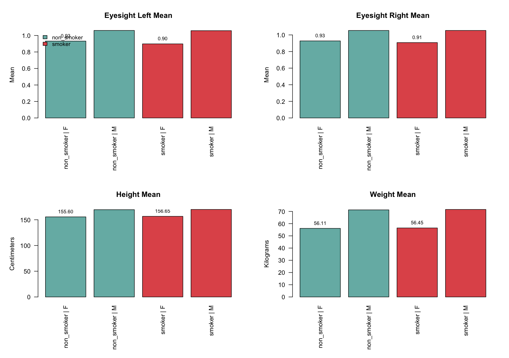
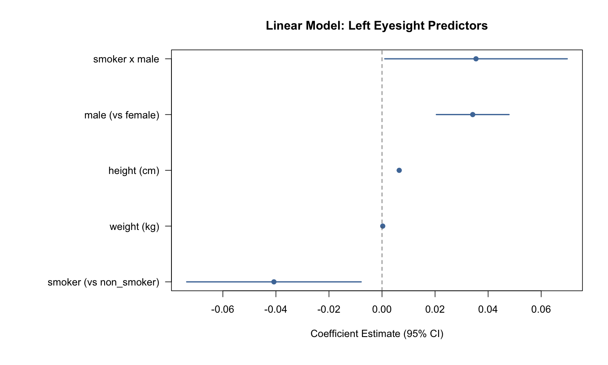
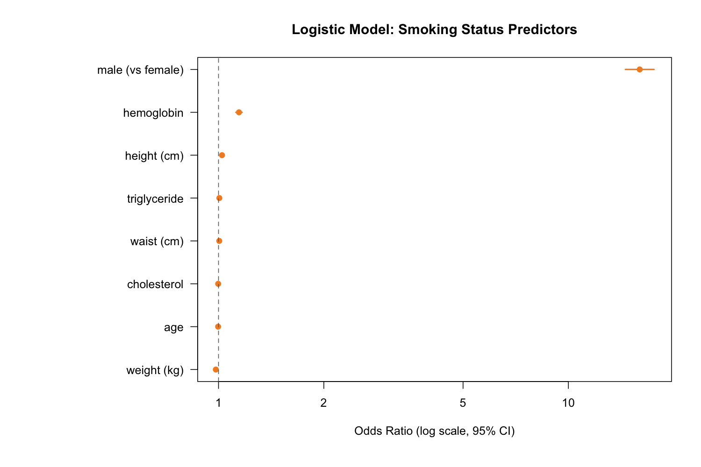

# Bioinformatics Project: Genomic Associations and Smoking Phenotype Modeling

## Biological Purpose

This project explores how smoking-related human phenotypes may align with genomic evidence layers.
Biologically, it is meant as a first-pass integration of:

- variant-level association signals
- regulatory context (`CpG`, `eQTL`)
- observed clinical/physiological markers in smokers vs non-smokers

The goal is not to claim causality, but to identify biologically plausible patterns that can guide deeper follow-up analyses.

## Biological Questions Addressed

- Which genomic annotation groups (`location`, `CpG`, `GWAS`, `eQTL`) show stronger mean association signal?
- Do smoking groups differ in visible phenotypes (eyesight, anthropometrics) when stratified by sex?
- Which clinical variables (age, body metrics, lipids, hemoglobin) are most associated with smoking status in this cohort?

## Data Used

- `data/raw/genomic_associations.csv`
  SNP-level association table with genomic/regulatory annotations and an `association_score`.
- `data/raw/smoking.csv`
  Participant-level smoking, demographic, and clinical biomarker data (anthropometric, cardiovascular, metabolic, and lab measures).
- `scripts/legacy/extended_analysis_original.R`
  Historical exploratory script kept as provenance/reference.

## Analysis Workflow

Run:

```bash
Rscript scripts/01_genomic_smoking_phenotype_analysis.R
```

The script:

- harmonizes column names for reproducibility
- summarizes mean genomic association score by annotation categories
- computes smoking-by-gender group means for key phenotypes
- fits a linear model for left-eye eyesight as a phenotype proxy
- fits a logistic model for smoking status using clinical predictors
- generates outcome figures and saves them to `outputs/figure_outcomes/`

## Output Files and Biological Meaning

- `outputs/genomic_association_score_summary.csv`
  Aggregate signal strength across genomic annotation strata.
- `outputs/smoking_gender_clinical_means.csv`
  Group-level phenotype differences potentially linked to smoking behavior.
- `outputs/linear_model_left_eyesight_smoking_gender.txt`
  Effect estimates for smoking/gender and body-size covariates on eyesight.
- `outputs/logistic_model_smoking_status_clinical_predictors.txt`
  Multivariable associations between clinical biomarkers and smoking status.
- `outputs/genomic_and_smoking_dataset_sizes.csv`
  Sample-size trace for both integrated sources.
- `outputs/figure_outcomes/01_dataset_sizes_barplot.png`
  Comparison of row counts across integrated datasets.
- `outputs/figure_outcomes/02_genomic_association_summary_barplot.png`
  Mean association score by genomic annotation pattern.
- `outputs/figure_outcomes/03_smoking_gender_clinical_means_panels.png`
  Group means for eyesight and anthropometric traits by smoking status and sex.
- `outputs/figure_outcomes/04_linear_model_coefficients.png`
  Linear model coefficient estimates with 95% confidence intervals.
- `outputs/figure_outcomes/05_logistic_model_odds_ratios.png`
  Logistic model odds ratios with 95% confidence intervals.

## Outcome Figures

### Dataset Size Comparison


### Genomic Association Summary


### Smoking and Gender Clinical Means


### Linear Model Coefficients


### Logistic Model Odds Ratios


## Project Structure

- `data/raw/` source datasets
- `scripts/01_genomic_smoking_phenotype_analysis.R` main reproducible analysis
- `scripts/legacy/` preserved historical script
- `outputs/` generated summaries and model reports
- `outputs/figure_outcomes/` generated figure outcomes from all analysis endpoints

## Notes

- This repository is designed as a biologically interpretable starting point for hypothesis generation.
- Next steps could include covariate expansion, interaction testing, and validation on independent cohorts.
